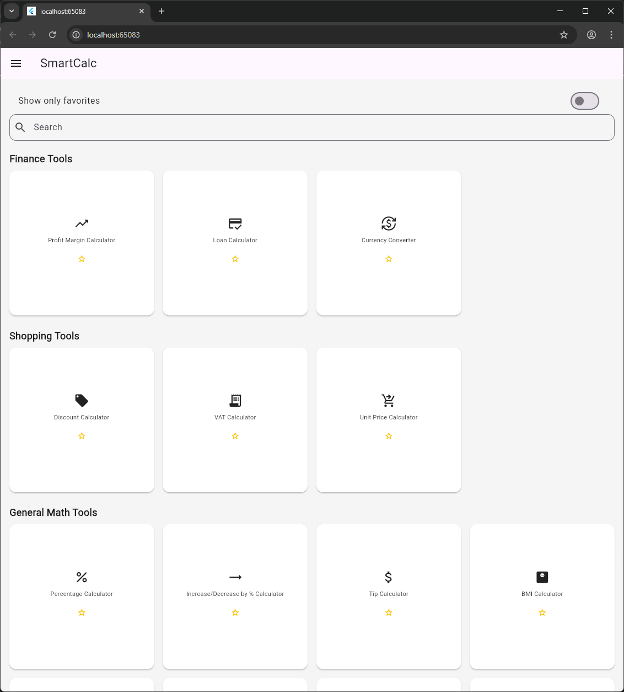
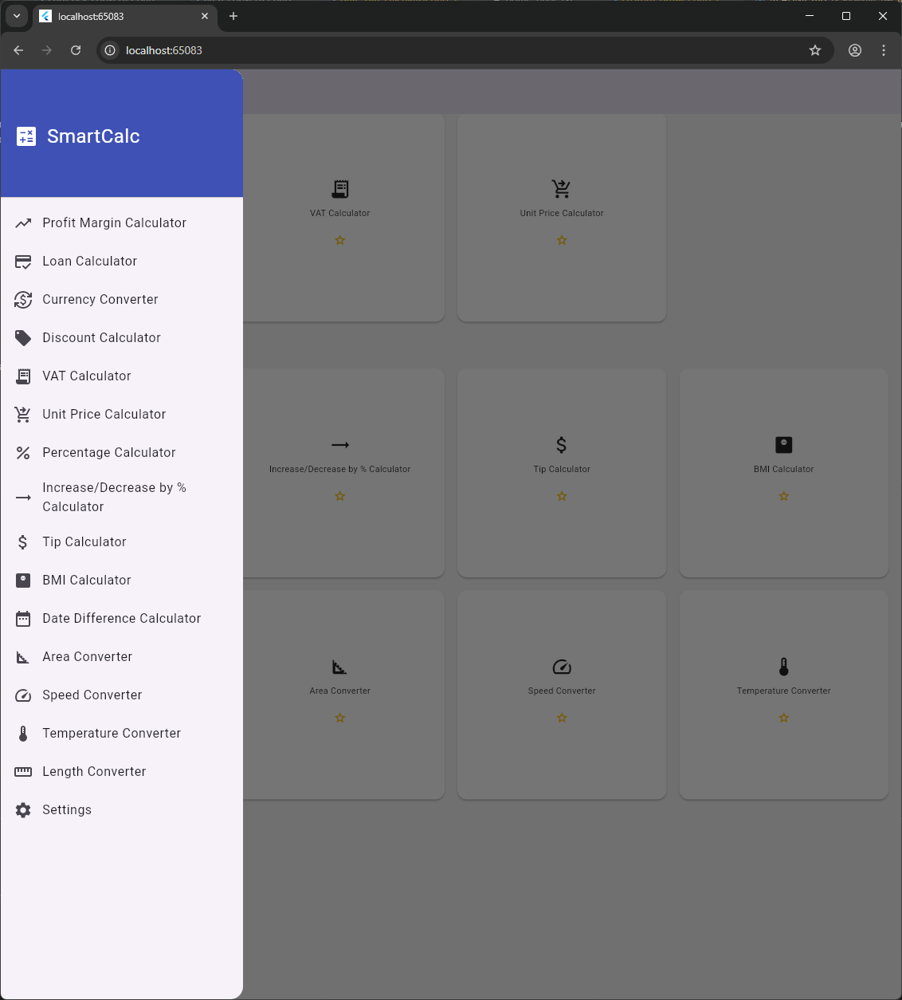
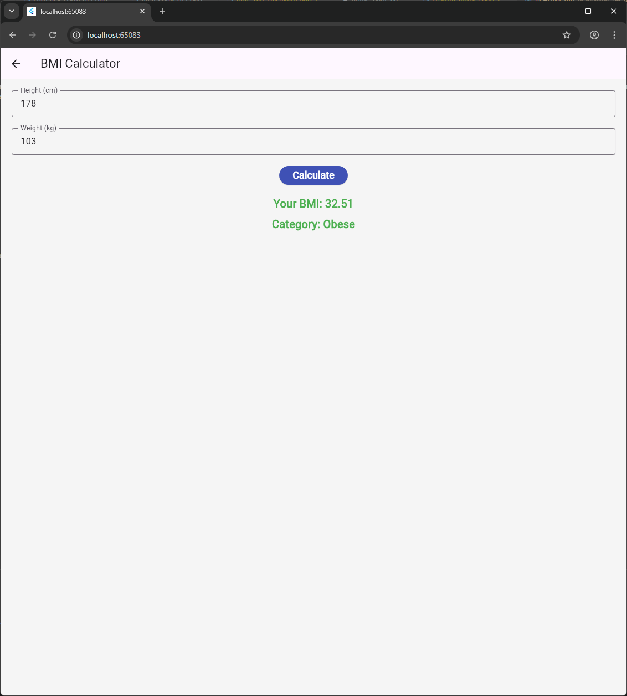

# smartcalc

- Why Built This

After years of full-stack web development (HTML, CSS, JavaScript, PHP, and .NET) — with a strong focus on WordPress over the past 13 years — and significant experience in desktop applications (including C#, Java), as well as deep involvement with relational databases like SQL Server, MySQL, and PL/SQL-driven systems, this project marks my first hands-on Flutter app.

SmartCalc was built not just as a learning exercise, but as a serious, functional, and fully extensible tool — designed to work seamlessly across mobile, web, and desktop environments.

It started with a simple percentage calculator, and evolved into a full offline toolkit with multi language support.

- To Run Locally

flutter pub get
flutter run

Make sure you're using Flutter 3.19+ with intl and shared_preferences added in pubspec.yaml

- Contributing

Pull requests welcome! Want to add a new calculator or translation? Fork it, build it, and make a PR!

- License

This project is open-source and available under the MIT License.

Built by a passionate dev discovering Flutter — and loving every widget of it 💙

### Home Page

### Drawer

### Calculator Page

